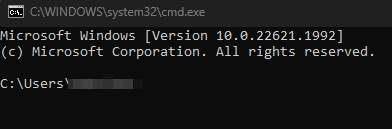

Markdown is a lightweight markup language used to make webpages easier on on the eye when displayed and simplier to read in plain text format. Markdown is widely popular due to its ease of use and that it is accepted by many applications such as documentation systems, note-taking applications, messaging systems and content management systems. 

The below examples showcase some of the basic Markdown syntax elements, however, there are more features and Markdown flavours available depending on the Markdown implementation or specific application you're using. For further information on markdown and a more robust syntax list please review https://www.markdownguide.org/

# Markdown Syntax Rendering

## Headings

Headings and subheadings may be used to provide an outline of how the page in structured by breaking up web pages into sections and introducing the reader to a new topic. With H1 being the largest and H6 the smallest headings available:

```
# H1
## H2
### H3
#### H4
##### H5
###### H6
```  

All headings in this article are between H1 and H4 size and the topics these are used for may be observed in the Table of Contents on the right hand side of this page.

## Emphasis

Emphasis is an important asset to assist readers pinpoint important points in text. Basic Markdown allows for the use of italic, bold, italic and bold, or strikethrough.

### Italic 

Italics are usually used for titles and names in writing such as books, movies, vessels, if the word is in an alternate language or if it is a new word or concept. For use of *italics* in markdown:

```
*Italic text*
```

### Bold 

To strongly emphasize keywords use **bold**:

```
**Bold text**
```

To use both ***italic and bold***, begin and end the words with three asterisks:

```
***Italic and bold***
```


### Strikethrough

The use of strikethrough can be a fun way to emphasize a change of idea or opinion. Such as; ~~You don't need to backup your storage.~~ Everyone needs to backup their storage:

```
~~You don't need to backup your storage.~~ Everyone needs to backup their storage.
```  

## Paragraph

Markdown renders paragraphs and line breaks as you would normally write them, there is no need for any special characters. However, traditional html paragraph code and line breaks may be used if required, however, caution should be taken with use of these as not all applications will render this code same way. 

## Blockquotes

A blockquote represents content that is quoted from another source. Markdown has systax for blockquotes with and without citation. When using citation for your sources these will be contained within the footer (see bottom of page).

#### Blockquote without Citation

> It always seems impossible until it's done.
> **Note:** *Markdown syntax* may be used within a blockquote for example to achieve *italic* or **bold** emphasis.

```
> It always seems impossible until it's done.
> **Note:** *Markdown syntax* may be used within a blockquote for example to achieve *italic* or **bold** emphasis.
```

#### Blockquote with Citation

> It always seems impossible until it's done.</p>
> — <cite>Nelson Mandela[^1]</cite>


```
> It always seems impossible until it's done.</p>
> — <cite>Nelson Mandela[^1]</cite>
```

## Footnotes

A footnote contains additional information printed at the bottom of the page for reference.

**Example:** Here's a small footnote,[^1] and here's a lengthier one containing a full paragraph with some code.[^bignote]

[^1]: Footnote one 

[^bignote]: A footnote with paragraphs and code.

    Indent your paragraphs to have them included in the footnote.

    `{ add some code }`

    See bottom of the page for the full output of footnotes
```
Here's a small footnote,[^1] and here's a lengthier one containing a full paragraph with some code.[^bignote]

[^1]: Footnote one 

[^bignote]: A footnote with paragraphs and code.

    Indent your paragraphs to have them included in the footnote.

    `{ add some code }`

    See bottom of the page for the full output of footnotes
```

[^1]: The above quote is a small footnote

## Tables

Markdown does not support tables as part of its core capabilities, however, many applications support them.

   | Name  | Age |
   | ----- | --- |
   | Rosa  | 25  |
   | Ben   | 32  |  

<br/>

```
   | Name  | Age |
   | ----- | --- |
   | Rosa  | 25  |
   | Ben   | 32  |  
```

## List Types

Lists provide the reader with a neat and ordered overview or set of instructions and Markdown supports multiple ways to create lists.

#### Ordered List

1. Milk
2. Bread
3. Flour

```
1. Milk
2. Bread
3. Flour
```

#### Unordered List

* Ordered Lists 
* Unordered Lists 
* Nested Lists 
* Task Lists

```
* Ordered Lists 
* Unordered Lists 
* Nested Lists 
* Task Lists 
```

#### Nested List

* Pantry
  * Pasta
  * Tomato Sauce
  * Cereal
* Fish
  * Cod
  * Hake
  
```
* Pantry
  * Pasta
  * Tomato Sauce
  * Cereal
* Fish
  * Cod
  * Hake
```

#### Task Lists

- [x] Sunblock
- [ ] Towel
- [ ] Beachwear

```
- [x] Sunblock
- [ ] Towel
- [ ] Beachwear
```

#### Image inside of a list

To place an image inside of the list: 

1. To open the command prompt on windows press "Windows + R". 
2. In the run program window type "cmd" and press "Enter" to launch the command prompt

    

3. Enjoy exploring the command line!

```
1. To open the command prompt on windows press "Windows + R". 
2. In the run program window type "cmd" and press "Enter" to launch the command prompt

    

3. Enjoy exploring the command line!
```

## Code Words

To denote a word or a phrase as code, enclose the word(s) in backticks. **Example:** At the command prompt, enter `vi newtextfile.txt`.

```
At the command prompt, enter `vi newtextfile.txt`.
```

## Code Blocks

Code blocks can be extremely useful when writing instructions especially in relation to computing and software. Thankfully, there are multiple ways to use code blocks with Markdown as seen below.

#### Code Block using Backticks

The easiest way to use a code block is to use three backticks (`) at the beginning of the code and three backticks at the end of the code.

```
<!DOCTYPE html>
<html lang="en">
<head>
  <meta charset="UTF-8">
  <title>Example HTML5 Document</title>
</head>
<body>
  <p>Paragraph</p>
</body>
</html>
```

#### Code Block using Four Indented Spaces

You may also use four indented spaces for a block of code.

```
    <!DOCTYPE html>
    <html lang="en">
    <head>
      <meta charset="UTF-8">
      <title>Example HTML5 Document</title>
    </head>
    <body>
      <p>Paragraph</p>
    </body>
    </html>
```    

#### Code Block Inside of a List

When writing instructions sometimes it is beneficial to have a code block in the middle of a list:

1. Open the command line
2. Run the following command on your Linux Ubuntu machine to install Go

        sudo apt-get install golang 

3. Enter your administrator password

Syntax:
```
1. Open the command line
2. Run the following command on your Linux Ubuntu machine to install Go

        sudo apt-get install golang 

3. Enter your administrator password
```

## Images

To insert an image in Markdown:


Syntax: 
```

```

## Links

To turn text into a [link from text](https://www.markdownguide.org) use:

Syntax:
```
[link from text](https://www.markdownguide.org)
```

## URLs and Email Addresses

To have a URL or an email address as a link you may enclose either in angle brackets. **Example:** Email me at <email@example.com> or visit <https://www.markdownguide.org> for further information.

```
<https://www.markdownguide.org>
<email@example.com>
```

## Horizontal rule
---
The horizontal rule creates a line across the page. This line in use may be observed at both the start and end of this section. The horizontal rule may be acieved by using three or more asterisks, dashes or underscores on their own. Please note mixing and matching these symbols will not achieve the horizontal rule.

```
***
---
___
```
---
## Footnote Example